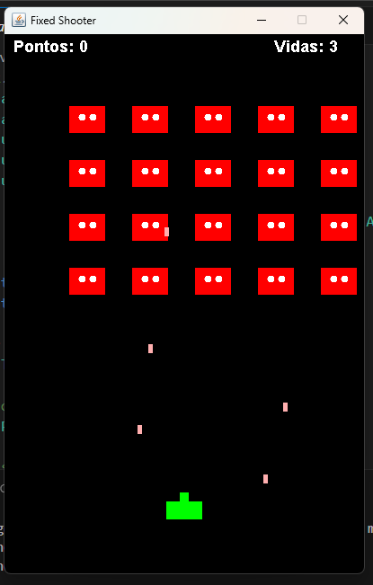

# Fixed Shooter Game - Java

Este é um jogo do tipo **Fixed Shooter**, inspirado no clássico *Space Invaders*, desenvolvido em Java para a atividade proposta no curso de Game Designer.

## Sobre o jogo

O jogador controla uma nave que se movimenta apenas na horizontal (eixo X) na parte inferior da tela. O objetivo é destruir ondas de inimigos que descem do topo da tela, evitando seus tiros e colisões. O jogador possui 3 vidas e pontua ao acertar os inimigos. Quando todas as ondas são destruídas, uma nova formação de inimigos surge.

## Funcionalidades

- Movimento do personagem controlado pelas setas esquerda e direita.
- Disparo de projéteis com a tecla de espaço.
- Inimigos que disparam projéteis e se movem em grupo.
- Sistema de pontuação e exibição de vidas.
- Tela fixa com resolução de 400x600 pixels.
- Condição de fim de jogo quando o jogador perde todas as vidas.

## Tecnologias

- Linguagem: Java
- Interface gráfica: JFrame e JPanel (bibliotecas padrão do Java)

## Como executar

1. Certifique-se de ter o JDK (Java Development Kit) instalado em seu computador.
2. Compile o arquivo `.java` com o comando: javac FixedShooterGame.java
3. Execute o jogo com o comando: java FixedShooterGame

## Screenshot do jogo

